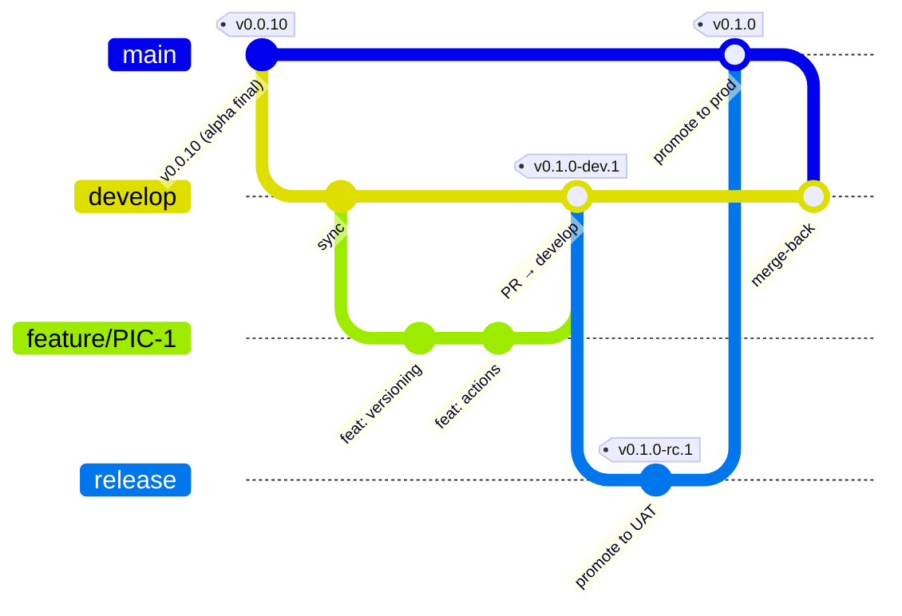
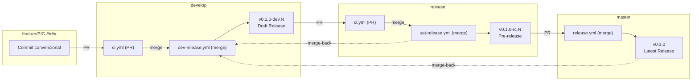
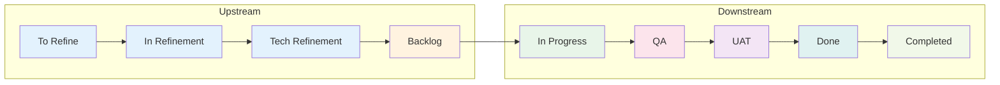

# PIC-1 — Esquema de Versionamento Semântico, Branching Model e CI/CD

**Issue**: [#6](https://github.com/normaii/picasso/issues/6)
**Status**: ✅ Aceito
**Data de Criação**: 2026-09-17
**Data de Aprovação**: 2026-09-19
**Autor**: @normaii

---

## Contexto

Com o encerramento da fase Alpha (v0.0.10), o projeto Picasso precisa formalizar o esquema de versionamento semântico, o modelo de branching, a geração automática de changelog e os pipelines de CI/CD para garantir entregas de software consistentes, rastreáveis e livres de conflitos entre ambientes.

O projeto é mantido por um dev solo com suporte de agentes de IA, o que exige que as regras sejam autodocumentadas e enforçáveis via automação, sem depender de ferramentas corporativas como Jira/Confluence.

---

## Decisões

### D1 — Branching Model (Git Flow Adaptado)



#### Branches e responsabilidades

| Branch | Propósito | Recebe PRs de | Publica? |
|--------|-----------|---------------|----------|
| `master` | Produção estável | `release`, `hotfix/*` | ✅ Release **latest** |
| `release` | UAT (testes de usuário) | `develop`, `hotfix/*` | ✅ Pre-release pública |
| `develop` | Integração de desenvolvimento | `feature/*`, `hotfix/*` | ✅ Draft release (invisível ao público) |
| `feature/PIC-####` | Trabalho por tarefa | — | ❌ Apenas CI |
| `hotfix/PIC-####` | Correção crítica de produção | — | ❌ Apenas CI |

#### Restrições de origem de PR (enforçadas via CI)

| Branch destino | Origens permitidas |
|----------------|-------------------|
| `master` | `release`, `hotfix/*` |
| `release` | `develop`, `hotfix/*` |
| `develop` | `feature/*`, `hotfix/*` |

> **Nota**: O GitHub Free não suporta restrição nativa de origem de PR. A validação é feita por um step na CI que checa `github.head_ref` e falha se a branch de origem não é permitida.

---

### D2 — Versionamento Semântico

**Formato**: `MAJOR.MINOR.PATCH[-sufixo.N]`

#### Tabela de incremento por evento

| Evento | Branch destino | Exemplo anterior | Versão gerada | Tipo de Release |
|--------|---------------|-----------------|---------------|-----------------|
| PR `feature/*` → `develop` | develop | `0.0.10` | `0.1.0-dev.1` | **Draft** (invisível) |
| PR `feature/*` → `develop` (2º) | develop | `0.1.0-dev.1` | `0.1.0-dev.2` | **Draft** (invisível) |
| PR `develop` → `release` | release | — | `0.1.0-rc.1` | **Pre-release** (pública) |
| PR `hotfix/*` → `release` | release | `0.1.0-rc.1` | `0.1.1-rc.1` | **Pre-release** (pública) |
| PR `release` → `master` | master | `0.0.10` | `0.1.0` | **Latest** (produção) |
| PR `hotfix/*` → `master` (emergência) | master | `0.1.0` | `0.1.1` | **Latest** (produção) |

#### Regras de bump por tipo de commit

| Tipo de commit | Bump | Exemplo |
|----------------|------|---------|
| `feat` | Minor | `0.1.0` → `0.2.0` |
| `fix` | Patch | `0.1.0` → `0.1.1` |
| `BREAKING CHANGE` | Major | `0.1.0` → `1.0.0` |
| `docs`, `style`, `refactor`, `chore`, `ci`, `test` | Nenhum | — |
| `perf` | Patch | `0.1.0` → `0.1.1` |

#### Sufixos por ambiente

| Ambiente | Sufixo | Exemplo | Visibilidade no GitHub |
|----------|--------|---------|----------------------|
| Desenvolvimento | `-dev.N` | `0.2.0-dev.3` | Draft release (somente devs) |
| UAT | `-rc.N` | `0.2.0-rc.1` | Pre-release (usuários de teste) |
| Produção | Nenhum | `0.2.0` | Latest release (todos) |

---

### D3 — Conventional Commits (Obrigatório)

A partir da v0.1.0, **todos os commits devem seguir o formato**:

```
<type>(<scope>): <description>

[optional body]

[optional footer(s)]
```

#### Tipos válidos

| Tipo | Significado | Gera bump? |
|------|-------------|------------|
| `feat` | Nova funcionalidade | ✅ Minor |
| `fix` | Correção de bug | ✅ Patch |
| `docs` | Documentação | ❌ |
| `style` | Formatação (sem lógica) | ❌ |
| `refactor` | Refatoração (sem feat/fix) | ❌ |
| `perf` | Melhoria de performance | ✅ Patch |
| `test` | Testes | ❌ |
| `chore` | Tarefas de manutenção | ❌ |
| `ci` | CI/CD | ❌ |

**Enforcement**: Validação local via `commitlint` + `husky` (pre-commit hook). Validação remota via CI.

---

### D4 — Changelog Automático

**Ferramenta**: `semantic-release` com os seguintes plugins:

| Plugin | Função |
|--------|--------|
| `@semantic-release/commit-analyzer` | Determina tipo de bump via commits |
| `@semantic-release/release-notes-generator` | Gera notas de release formatadas |
| `@semantic-release/changelog` | Atualiza `CHANGELOG.md` no repositório |
| `@semantic-release/npm` | Atualiza versão no `package.json` (sem publicar no npm) |
| `@semantic-release/git` | Commita `CHANGELOG.md` e `package.json` |
| `@semantic-release/github` | Cria/atualiza GitHub Release |

O `CHANGELOG.md` é mantido na raiz do repositório e atualizado automaticamente a cada release.

---

### D5 — GitHub Actions (CI/CD)

#### Pipeline visual



#### Actions por arquivo

| Arquivo | Trigger | Função |
|---------|---------|--------|
| `ci.yml` | PRs para `develop`, `release`, `master` | Validação de build + check de branch de origem |
| `dev-release.yml` | Push/merge em `develop` | semantic-release (dev) + electron-builder → **Draft release** |
| `uat-release.yml` | Push/merge em `release` | semantic-release (rc) + electron-builder → **Pre-release** + merge-back → develop |
| `release.yml` | Push/merge em `master` | semantic-release (prod) + electron-builder → **Latest release** + merge-back → develop |

#### Merge-back automático

- Após merge em `release`: Action faz merge automático `release` → `develop`
- Após merge em `master`: Action faz merge automático `master` → `develop`
- Em caso de conflito: a Action cria uma PR de merge-back para resolução manual

---

### D6 — Ciclo de Vida das Tarefas (GitHub Projects)

#### Trilha de status



#### Definição de cada status

| Status | Fase | Descrição | Critério de entrada | Critério de saída |
|--------|------|-----------|--------------------|--------------------|
| **To Refine** | Upstream | Issue criada, aguardando refinamento de produto | Issue aberta com título e contexto mínimo | Objetivos e escopo definidos na issue |
| **In Refinement** | Upstream | Refinamento de produto em andamento | Objetivos claros | Decisões de produto documentadas, critérios de aceite definidos |
| **Tech Refinement** | Upstream | Refinamento técnico (como será executado) | Decisões de produto finalizadas | ADR criado com especificações técnicas, acordos de implementação |
| **Backlog** | Upstream/Downstream | Tarefa refinada e pronta para execução (DOR atingido) | ADR aprovado, branch `feature/PIC-####` pronta | Desenvolvedor/agente inicia a execução |
| **In Progress** | Downstream | Implementação em andamento | Branch criada, ADR como referência | Código implementado, PR aberto para `develop` |
| **QA** | Downstream | Testes e validações do desenvolvedor/QA | PR aberto, build passando na CI | Testes manuais aprovados, PR merged em `develop`, draft release gerada |
| **UAT** | Downstream | Testes de usuário final | PR merged em `release`, pre-release publicada | Usuário aprova a funcionalidade |
| **Done** | Downstream | Aprovado pelo usuário, aguardando release de produção | Aprovação do usuário | PR `release` → `master` merged |
| **Completed** | Downstream | Release integrada à versão final de produção | Latest release publicada com a feature | — (estado terminal) |

#### Visualizações no GitHub Projects

| View | Status visíveis | Propósito |
|------|----------------|-----------|
| **Upstream** | To Refine, In Refinement, Tech Refinement, Backlog | Planejamento e refinamento |
| **Downstream** | Backlog, In Progress, QA, UAT, Done, Completed | Execução e entrega |

> **Pendência futura**: Definir o que acontece com tarefas no status "Completed" após um período — possível arquivamento automático ou movimentação para uma view de histórico.

---

### D7 — Branch Protection Rules

| Branch | Requer PR | CI obrigatória | Restrição de origem (via CI) |
|--------|-----------|---------------|------------------------------|
| `master` | ✅ | ✅ | Apenas `release`, `hotfix/*` |
| `release` | ✅ | ✅ | Apenas `develop`, `hotfix/*` |
| `develop` | ✅ | ✅ | Apenas `feature/*`, `hotfix/*` |

---

## Justificativa

1. **SemVer com sufixos**: Permite identificar instantaneamente o ambiente de uma versão sem consultar metadados externos.
2. **Draft releases para dev**: Garante que builds de desenvolvimento nunca chegam ao público acidentalmente, enquanto mantém rastreabilidade completa.
3. **semantic-release**: Elimina erro humano no versionamento e garante que o changelog é sempre preciso e atualizado.
4. **Conventional Commits**: Padroniza a comunicação no histórico do Git, permitindo changelogs automatizados e bump inteligente.
5. **Merge-back automático**: Elimina a tarefa manual de sincronização de branches após releases.
6. **Ciclo de vida das tarefas**: Garante rastreabilidade completa de uma ideia até a entrega em produção, sem depender de ferramentas externas (Jira/Confluence).

---

## Consequências

- Todo commit que não seguir Conventional Commits será rejeitado pelo `commitlint` (local) e pela CI (remoto).
- O `CHANGELOG.md` se torna a fonte única de verdade para "o que mudou em cada versão".
- A branch `release` precisa ser criada e configurada como parte desta tarefa.
- Os desenvolvedores e agentes de IA devem consultar o Steering Memory antes de iniciar qualquer trabalho.
- A movimentação de status no GitHub Projects é responsabilidade do desenvolvedor/agente que está executando a tarefa.

---

## Especificações de Implementação

### Arquivos a criar/modificar

| Ação | Arquivo | Descrição |
|------|---------|-----------|
| MODIFY | `package.json` | Adicionar devDeps: semantic-release, commitlint, husky |
| NEW | `release.config.js` | Config multi-branch do semantic-release |
| NEW | `.commitlintrc.json` | Config do commitlint |
| NEW | `.husky/commit-msg` | Hook de validação de commit |
| MODIFY | `.github/workflows/ci.yml` | Adicionar `release` + validação de branch de origem |
| NEW | `.github/workflows/dev-release.yml` | Pipeline develop → draft release |
| NEW | `.github/workflows/uat-release.yml` | Pipeline release → pre-release + merge-back |
| REWRITE | `.github/workflows/release.yml` | Pipeline master → latest release + merge-back |
| NEW | `CHANGELOG.md` | Arquivo de changelog (gerenciado pelo semantic-release) |
| UPDATE | `docs/ADR/PIC-1.md` | Este documento (decisões finais) |
| UPDATE | `docs/steering/memory.md` | Seções 4 e 5 atualizadas |
| CREATE | Branch `release` | Criar a partir de `master` |

### Verificação (executada por agente)

1. Push de teste em `develop` → verificar que draft release `v0.1.0-dev.1` foi gerada no GitHub
2. PR `develop` → `release` → verificar que pre-release `v0.1.0-rc.1` foi gerada
3. PR `release` → `master` → verificar que latest release `v0.1.0` foi gerada
4. Verificar que merge-back atualizou `develop` automaticamente
5. Verificar que `CHANGELOG.md` contém as notas corretas em cada branch
6. Verificar que `package.json` tem a versão correta em cada branch
7. Verificar que releases Draft não aparecem na listagem pública (`gh release list` sem `--include-drafts`)

---

## Referências

- [ADR-018 (Alpha Baseline)](./ADR-ALPHA-BASELINE.md#adr-018) — Pipeline de Auto-Bumping e Pre-Releases (versão Alpha, superseded por esta decisão)
- [Steering Memory](../steering/memory.md) — Documentação viva do projeto
- [Conventional Commits Spec](https://www.conventionalcommits.org/)
- [Semantic Release Docs](https://semantic-release.gitbook.io/)
