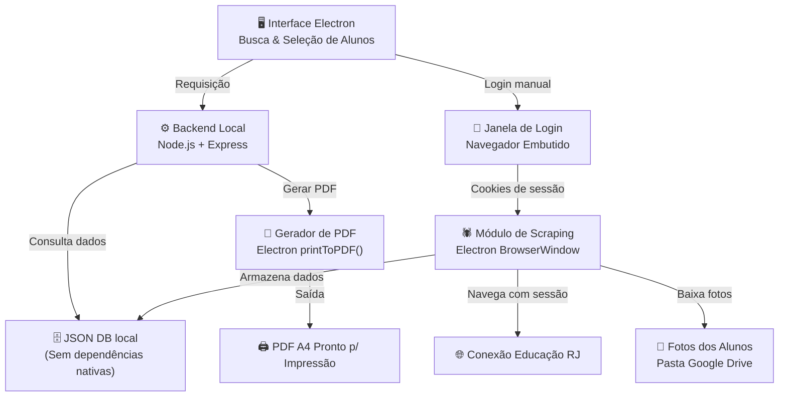

# Picasso — Gerador de Carteirinha Escolar

Solução para automatizar a geração de carteirinhas estudantis prontas para impressão. O sistema faz scraping dos dados dos alunos (nome, matrícula, turma e foto) do **Conexão Educação (RJ)** usando a sessão autenticada do diretor, apresenta uma interface pesquisável para seleção de alunos e gera PDFs em formato A4 com as carteirinhas.

---

## Revisão do Usuário

> [!IMPORTANT]
> **Mudança arquitetural**: Como o login no Conexão Educação requer CAPTCHA, o fluxo será: abrir uma janela de navegador embutida (Electron) para o diretor fazer login manualmente → capturar os cookies da sessão → usar esses cookies para scraping automatizado.

> [!IMPORTANT]
> **Armazenamento em Google Drive**: Os dados (fotos, banco de dados SQLite) serão armazenados em uma pasta local sincronizada com Google Drive. O caminho da pasta será configurável.

---

## Arquitetura Proposta (Atualizada para Produção)



### Stack Tecnológica & Estratégia de Setup

| Camada | Tecnologia | Justificativa |
|---|---|---|
| **Distribuição / Setup** | **Instalador `.exe` (Electron Builder)** | **Resolução do problema de setup**: O diretor não precisa de Node.js, `npm` ou terminais. Um único arquivo `.exe` instala o programa como um software comum do Windows. |
| **Aplicação Desktop** | Electron | Janela de login embutida para CAPTCHA, app local offline |
| **Front-End** | HTML + CSS + JS (Vanilla) | Design premium, sem build step |
| **Backend** | Node.js + Express | API local, orquestra scraping e geração de PDF |
| **Scraping** | Electron `BrowserWindow` (Invisível) | **Mudança**: Removemos o *Playwright*. O próprio Electron já tem o Chromium embutido, economizando ~150MB e evitando problemas de download de navegadores em redes bloqueadas de escolas. |
| **Banco de Dados** | JSON Local (Custom) | **Mudança**: Removemos o *SQLite*. O SQLite (seja `better-sqlite3` ou `node:sqlite`) causa problemas de compilação ou incompatibilidade de versão de Node no Electron. Como escolas têm no máximo alguns milhares de alunos, um arquivo JSON é instantâneo e zero-dependência. |
| **Geração de PDF** | Electron `printToPDF()` | **Mudança**: Removemos o *Puppeteer*. O Electron gera PDFs de forma nativa e idêntica ao Puppeteer. |
| **Armazenamento** | Pasta local (Google Drive sync) | Fotos e JSON sincronizados na nuvem automaticamente |

---

## Detalhes do Scraping — Conexão Educação

### Fluxo de Login (Manual)
1. Abrir janela Electron apontando para `https://conexao.educacao.rj.gov.br`
2. Diretor faz login manualmente (preenche CAPTCHA)
3. Após login detectado, capturar cookies da sessão
4. Fechar janela de login, usar cookies no Playwright

### Scraping da Lista de Alunos
- **URL**: `https://conexao.educacao.rj.gov.br/ConexaoEducacao/Relatorio/PageViewer.aspx?report=RelAlunosMatPTurma&grp=GESTAO`
- Navegar ao relatório com os cookies capturados
- Parsear tabela HTML para extrair: **Nome**, **Matrícula**, **Turma**
- Iterar por todas as turmas disponíveis

### Scraping da Foto do Aluno
- **URL base**: `https://conexao.educacao.rj.gov.br/ConexaoEducacao/Academico/Alunos.aspx`
- Para cada matrícula: buscar o aluno na página → obter o link da foto
- **Elemento da foto**: `img#ct100_cphFormulario_bimgFotoPessoa`
- **URL da foto**: `src="/ConexaoEducacao/Academico/Alunos.aspx?DXCache={hash}"`
- Baixar e salvar como `{matricula}.jpg` na pasta de fotos

---

## Mudanças Propostas

### 1. Scaffolding do Projeto

#### [NEW] `picasso/package.json`
- Scripts: `dev`, `scrape`, `build`
- Dependências: `electron`, `express`, `playwright`, `better-sqlite3`, `puppeteer`, `cors`

#### [NEW] `picasso/.env.example`
- `DATA_DIR` — caminho da pasta Google Drive
- `SYSTEM_URL` — URL do Conexão Educação

#### [NEW] `picasso/main.js`
- Entry point do Electron
- Gerencia janela principal e janela de login

#### [NEW] `picasso/server.js`
- Servidor Express embutido (roda dentro do Electron)
- Serve arquivos estáticos e monta rotas de API

---

### 2. Camada de Banco de Dados

#### [NEW] `picasso/src/db/schema.sql`
- Tabela `alunos`: `id`, `nome`, `matricula`, `turma_id`, `turma_nome`, `foto_path`, `data_scraping`
- Tabela `log_scraping`: `id`, `inicio`, `fim`, `status`, `total_alunos`

#### [NEW] `picasso/src/db/database.js`
- Inicialização e migração do SQLite
- Funções: `upsertAluno()`, `buscarAlunos()`, `getAlunosPorIds()`, `getTurmas()`
- Caminho do arquivo DB configurável (Google Drive)

---

### 3. Módulo de Scraping

#### [NEW] `picasso/src/scraper/sessionManager.js`
- Abre janela Electron para login manual
- Monitora navegação para detectar login bem-sucedido
- Exporta cookies da sessão

### 3. Serviço de Scraping e Extração (Automator)

O sistema do Governo utiliza **Microsoft SQL Server Reporting Services (SSRS)** na página `PageViewer.aspx`. Este sistema é baseado em **ASP.NET WebForms**, o que significa que o estado da página é mantido por `__VIEWSTATE` e cada seleção em um dropdown (Regional, Município, Escola) dispara um `__doPostBack`, recarregando a página. Além disso, o relatório final é renderizado dentro de um `iframe` interno.

Para automatizar essa extração, o `scraper.js` implementará uma **Máquina de Estados (State Machine)** controlando a `BrowserWindow` invisível:

#### Máquina de Estados de Navegação

1. **Estado `SELECT_FILTERS` (Preenchimento em Cascata)**
   - O Node.js escuta o evento `did-stop-loading` (ou injeta polling) na página.
   - O script avalia os dropdowns na seguinte ordem:
     1. **Regional** (`rptViewer_ctl00_ctl03_ddValue`)
     2. **Município** (`rptViewer_ctl00_ctl05_ddValue`)
     3. **Escola** (`rptViewer_ctl00_ctl07_ddValue`)
     4. **Ano** (`rptViewer_ctl00_ctl09_ddValue`)
     5. **Semestre** (`rptViewer_ctl00_ctl11_ddValue`)
   - Se algum dropdown estiver no valor "Selecione..." (`value="1"` ou `value="0"`), o scraper seleciona a primeira opção válida (ex: `value="2"`) e dispara `__doPostBack(ID, '')`. O Node.js aguarda o reload e repete o processo.
   - Quando todos os dropdowns superiores estiverem preenchidos, o scraper extrai todos os `<option>` válidos do dropdown **Turma** (`rptViewer_ctl00_ctl13_ddValue`) e os salva na memória.
   - Transição para o Estado `SCRAPE_TURMAS`.

2. **Estado `SCRAPE_TURMAS` (Loop de Extração)**
   - Para cada turma na lista extraída:
     - Injeta JS para selecionar a Turma atual no dropdown.
     - Clica no botão **View Report** (`rptViewer_ctl00_ctl00`).
     - Inicia um polling aguardando o `iframe` (`ReportFramerptViewer`) ser carregado e o loading do SSRS desaparecer.
     - Acessa o `contentDocument` do `iframe`.
     - Executa o seletor CSS (a ser definido após debug do HTML interno) para raspar a tabela de alunos (Nome e Matrícula).
     - Salva os alunos no banco de dados vinculados à Turma selecionada.
   - Após iterar todas as turmas, a janela invisível é destruída e o processo de scraping é marcado como Concluído.

#### Fallback de Debug (Ativo Atualmente)
Como ainda não conhecemos a estrutura HTML interna do relatório gerado pelo SSRS, a primeira execução bem-sucedida do loop de Turmas não encontrará os seletores corretos. Nesse caso, o scraper **salvará o HTML completo do iframe no arquivo `debug_report.html`** e pausará a extração. O usuário enviará este arquivo para mapearmos os seletores finais.

---

### 4. Geração de Carteirinha / PDF

#### [NEW] `picasso/src/generator/cardTemplate.html`
- Template HTML/CSS para uma carteirinha individual
- Dimensões exatas para impressão (86mm × 54mm — tamanho cartão)
- Inclui: logo da escola, foto do aluno, nome, matrícula, turma, ano
- Design premium e moderno

#### [NEW] `picasso/src/generator/a4Layout.html`
- Template de página A4 com grid de carteirinhas
- Otimizado para impressão padrão A4 (210mm × 297mm)
- ~8-10 carteirinhas por página (2 colunas × 4-5 linhas)

#### [NEW] `picasso/src/generator/pdfGenerator.js`
- Recebe array de objetos de alunos
- Injeta dados no template da carteirinha
- Organiza em layout A4
- Puppeteer converte HTML → PDF
- Retorna caminho do arquivo PDF

---

### 5. API Backend

#### [NEW] `picasso/src/api/routes.js`
- `GET /api/alunos` — Buscar/listar alunos (com filtros)
- `GET /api/alunos/:id` — Detalhes de um aluno
- `GET /api/turmas` — Listar turmas disponíveis
- `POST /api/gerar` — Gerar PDF para alunos selecionados
- `GET /api/download/:arquivo` — Baixar PDF gerado
- `POST /api/scraping/iniciar` — Iniciar operação de scraping
- `GET /api/scraping/status` — Verificar progresso do scraping

---

### 6. Interface Front-End

#### [NEW] `picasso/public/index.html`
- Página principal SPA em português
- Barra de busca, filtro por turma, grid de alunos, barra de ações

#### [NEW] `picasso/public/css/styles.css`
- Design system premium com dark mode
- Cards com glassmorphism, animações suaves
- Layout responsivo, estilos otimizados para impressão

#### [NEW] `picasso/public/js/app.js`
- Lógica de busca e filtragem de alunos
- Multi-seleção com feedback visual
- Ação de gerar PDF (chama API, mostra progresso, dispara download)
- Botão de iniciar scraping com indicador de progresso

---

## Estrutura de Pastas

```
picasso/
├── main.js                      # Entry point Electron
├── server.js                    # Servidor Express embutido
├── package.json
├── .env.example
├── public/                      # Front-end (servido como estático)
│   ├── index.html
│   ├── css/
│   │   └── styles.css
│   └── js/
│       └── app.js
├── src/
│   ├── api/
│   │   └── routes.js            # Endpoints da API
│   ├── db/
│   │   ├── schema.sql           # Schema do banco
│   │   └── database.js          # Operações do banco
│   ├── scraper/
│   │   ├── sessionManager.js    # Login manual + cookies
│   │   ├── scraper.js           # Orquestrador de scraping
│   │   ├── studentListParser.js # Parsing HTML
│   │   └── photoFetcher.js      # Download de fotos
│   └── generator/
│       ├── cardTemplate.html    # Template da carteirinha
│       ├── a4Layout.html        # Layout A4 multi-carteirinha
│       └── pdfGenerator.js      # HTML → PDF
├── data/                        # Ou na pasta Google Drive
│   ├── fotos/                   # Fotos dos alunos
│   └── gerados/                 # PDFs gerados
└── assets/                      # Logo, placeholder
```

---

## Fases de Desenvolvimento

### Fase 1 — Fundação 🏗️
- Scaffolding do projeto, dependências, schema do banco
- Servidor Express básico servindo arquivos estáticos
- Configuração do Electron (janela principal)
- Camada de banco de dados com operações CRUD

### Fase 2 — Módulo de Scraping 🕷️
- Fluxo de login manual via Electron (captura de cookies)
- Parsing da lista de alunos do relatório
- Download de fotos dos alunos
- Armazenamento no SQLite

### Fase 3 — Carteirinha & Geração de PDF 📄
- Design do template HTML/CSS da carteirinha
- Sistema de layout A4
- Pipeline HTML → PDF

### Fase 4 — Interface Front-End 🎨
- UI premium com busca, filtros, multi-seleção
- Integração com API backend
- Trigger de geração de PDF e fluxo de download

### Fase 5 — Polimento & Testes 🧪
- Tratamento de erros e edge cases
- Loading states, indicadores de progresso
- Testes end-to-end com dados reais

---

## Plano de Verificação

### Testes Automatizados
- Testes unitários para operações do banco de dados
- Testes unitários para parsing HTML (fixtures mock)
- Teste de integração para geração de PDF (verificar saída válida)

### Verificação Manual
- Rodar scraper contra o sistema real (requer credenciais)
- Inspeção visual das carteirinhas geradas
- Teste de impressão em papel A4 para verificar dimensões
- Teste do front-end no navegador embutido
