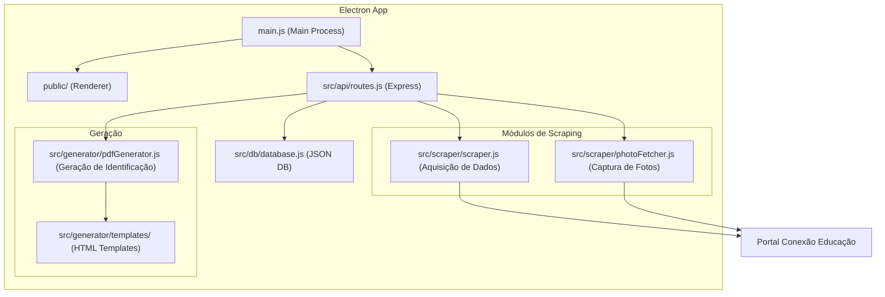
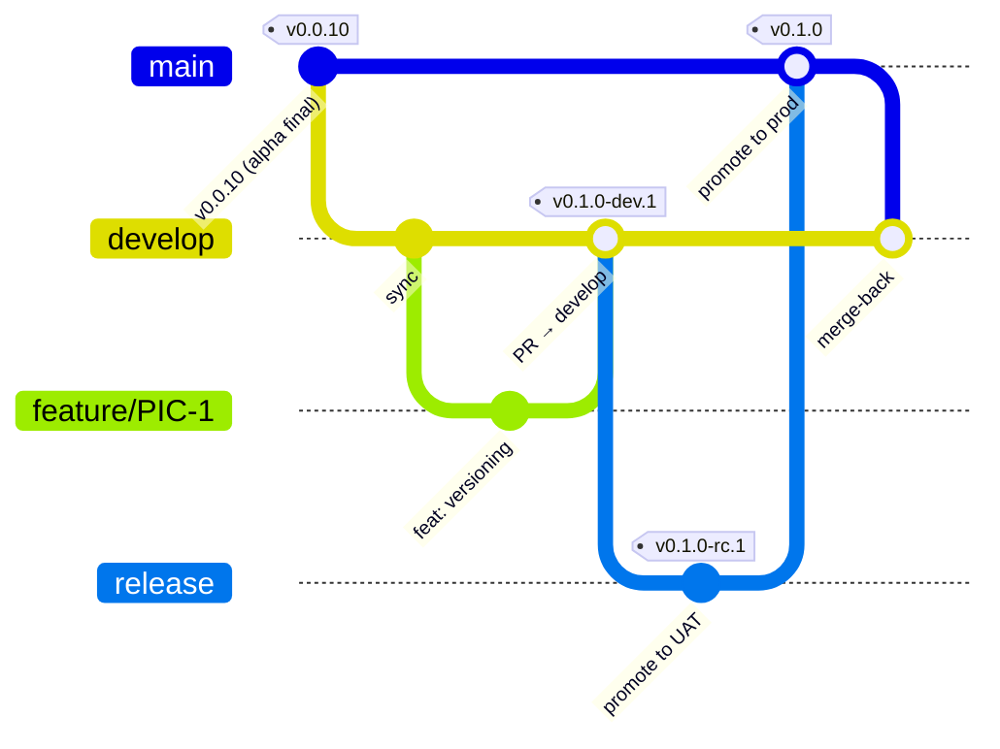
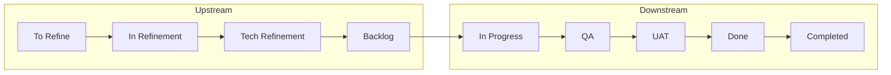
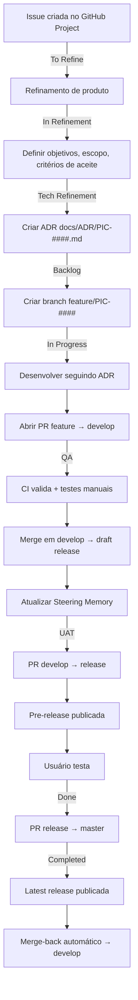

# Picasso — Steering Memory

> **Última atualização**: 2026-09-25
> **Propósito**: Documentação viva do projeto Picasso. Cada seção descreve **como** um módulo ou aspecto do sistema funciona atualmente e **por quê**, referenciando o ADR que justifica o comportamento.
>
> Este documento é a **porta de entrada** para qualquer agente de IA ou desenvolvedor que precise entender a lógica do projeto sem ler código.
> Se a informação que você procura não está aqui, trata-se de um **"lack of specification"** — crie a especificação no ADR vigente e atualize este documento.

---

## Índice

- [1. Visão Geral](#1-visão-geral)
- [2. Arquitetura de Alto Nível](#2-arquitetura-de-alto-nível)
- [3. Módulos do Sistema](#3-módulos-do-sistema)
- [4. Guardrails de Desenvolvimento](#4-guardrails-de-desenvolvimento)
- [5. Branching Model e Versionamento](#5-branching-model-e-versionamento)
- [6. Ciclo de Vida das Tarefas](#6-ciclo-de-vida-das-tarefas)
- [7. Fluxo de Desenvolvimento](#7-fluxo-de-desenvolvimento)
- [8. Registro de Decisões Ativas](#8-registro-de-decisões-ativas)

---

## 1. Visão Geral

**Picasso** é uma aplicação desktop (Electron) para geração automatizada de carteirinhas estudantis a partir de dados raspados do portal **Conexão Educação** (SEEDUC-RJ).

| Aspecto | Detalhe | Ref |
|---------|---------|-----|
| Tipo | Desktop offline (Electron) | [ADR-003](ADR/ADR-ALPHA-BASELINE.md#adr-003) |
| Idioma | pt-BR | [ADR-005](ADR/ADR-ALPHA-BASELINE.md#adr-005) |
| Stack | Electron + Vanilla JS + Express + JSON DB | [ADR-006](ADR/ADR-ALPHA-BASELINE.md#adr-006) |
| Distribuição | Instalador `.exe` via electron-builder | [ADR-011](ADR/ADR-ALPHA-BASELINE.md#adr-011) |
| Multi-escola | Sim, parametrizável | [ADR-012](ADR/ADR-ALPHA-BASELINE.md#adr-012) |

---

## 2. Arquitetura de Alto Nível

---

## 3. Módulos do Sistema

### 3.1 Autenticação (Login)

O portal SEEDUC possui CAPTCHA, impossibilitando login automático. O diretor faz login manualmente em uma janela Electron embutida. Após autenticação, os cookies de sessão são capturados e reutilizados pelos módulos de scraping.

- **Comportamento atual (v0.0.10)**: Login é feito na Home Screen da aplicação. Sucesso exibe confirmação visual. Cookies ficam em memória durante o ciclo de vida da aplicação.
- **Evolução planejada**: Persistência criptografada de cookies via `safeStorage` do Electron (Pós-V1).
- **Ref**: [ADR-002](ADR/ADR-ALPHA-BASELINE.md#adr-002), [ADR-020](ADR/ADR-ALPHA-BASELINE.md#adr-020)

### 3.2 Módulo AdD (Aquisição de Dados)

Extrai nomes, matrículas e turmas do relatório `RelAlunosMatPTurma` do SEEDUC.

- **Comportamento atual**: Itera por **todos os semestres** disponíveis no dropdown, extrai turmas de cada semestre, e para cada turma extrai os alunos. Dados são persistidos no JSON DB.
- **Ref**: [ADR-007](ADR/ADR-ALPHA-BASELINE.md#adr-007)

### 3.3 Módulo CdF (Captura de Fotos)

Baixa as fotos dos alunos da página `Alunos.aspx` do SEEDUC.

- **Comportamento atual**: Usa workers paralelos (BrowserWindow ocultas). Cada worker busca aluno por matrícula, aguarda carregamento do componente DevExpress, e extrai a imagem via canvas ou fetch.
- **Particularidade SEEDUC**: O portal **hardcoda** `alt="sem foto"` em todas as imagens, independente de ter foto ou não. O scraper **ignora** o atributo `alt` e valida apenas pela URL (`DXCache`, `DXR.axd`, etc.).
- **Avatar padrão**: Quando o aluno realmente não tem foto (URL vazia, `#`, ou contendo `sem_foto`), um avatar padrão local é aplicado.
- **Reprocessamento**: Suporta flag "forçar reprocessamento" que re-baixa fotos independente do status atual.
- **Ref**: [ADR-008](ADR/ADR-ALPHA-BASELINE.md#adr-008)

### 3.4 Módulo GdI (Geração de Identificação / PDF)

Gera PDFs A4 com carteirinhas dos alunos.

- **Comportamento atual**: Monta HTML completo (template A4 + template de carteirinha), salva em arquivo temporário, carrega em BrowserWindow oculta via `loadFile()`, e usa `printToPDF()` para gerar o PDF. O arquivo temporário é deletado após a geração.
- **Nota técnica**: O carregamento via `loadFile()` (ao invés de `data:` URI) é obrigatório para evitar `ERR_INVALID_URL` quando as imagens base64 embutidas excedem o limite de URL do Chromium.
- **Ref**: [ADR-009](ADR/ADR-ALPHA-BASELINE.md#adr-009)

### 3.5 Armazenamento (JSON DB)

- **Comportamento atual**: Arquivo JSON simples lido inteiramente em memória ao iniciar. Salvamento síncrono a cada mutação. O banco gerencia as tabelas de `alunos`, `log_scraping` e `configuracoes` globais.
- **Localização**: `%APPDATA%/picasso/data/picasso_db.json`
- **Ref**: [ADR-004](ADR/ADR-ALPHA-BASELINE.md#adr-004), [PIC-2](ADR/PIC-2.md)

### 3.6 Módulo de Arquivamento e Expurgo (PIC-3 — LGPD)

Implementa o encerramento do ciclo letivo: soft-delete de banco e PDFs + hard-delete de fotos.

- **Comportamento atual**: Botão "Encerrar Ciclo Letivo" na aba Configurações abre modal de dupla confirmação (digitar "ENCERRAR"). Ao confirmar:
  1. Copia o JSON do banco para `archive_db/` com timestamp.
  2. Move os PDFs para `pdfs/archive_pdfs/` com timestamp.
  3. Renomeia `fotos/` para pasta temporária, grava marcador `.archive_committed`, e exclui fisicamente.
  4. Limpa o banco de dados em memória (alunos, logs, IDs) e persiste via gravação atômica.
- **Gravação Atômica (Windows-safe)**: `saveDb()` grava em `picasso_db.json.tmp` e tenta `renameSync`. Se falhar (EPERM/EBUSY por antivírus ou indexer do Windows), usa fallback `copyFileSync` + `unlinkSync`. Exceções propagam para abortar o expurgo.
- **Concorrência**: Flag global `isArchiving` (try/finally) bloqueia scraping, download de fotos e geração de PDFs (tanto `/api/gerar` quanto `/api/pdf/gerar`). Flag `isScrapingRunning` no `scraper.js` previne duplo scraping e estados zumbis.
- **Hard-Delete de Fotos**: Se `rmSync` falhar ao excluir fisicamente as fotos, a operação retorna `success: false` com mensagem de erro clara para a UI, exigindo remoção manual pelo operador.
- **Crash Recovery**: No boot (`initDatabase`), varredura **síncrona** de pastas `fotos_temp_delete_*`. Se a pasta tem marcador `.archive_committed` → lixo pós-commit (apagar). Se não tem marcador e `fotos/` sumiu → crash pré-commit (restaurar fotos).
- **Autenticação**: Header `x-admin-key` com valor de `process.env.ADMIN_SECRET` (fallback hardcoded para Beta local).
- **Acessibilidade**: Modal com `role="dialog"`, `aria-modal`, Focus Management e tecla ESC.
- **Decisões Diferidas**: Autenticação robusta, race condition assíncrono do PhotoFetcher → documentados no ADR como backlog futuro.
- **Risco Residual Aceito**: Micro-janela de crash (~1ms) entre `saveDb()` e gravação do `.archive_committed` — probabilidade infinitesimal, mitigação manual.
- **Ref**: [PIC-3](ADR/PIC-3.md)

---

## 4. Guardrails de Desenvolvimento

> **Ref**: [PIC-1](ADR/PIC-1.md) — Decisões D3, D6

Estas regras são **obrigatórias** para todo desenvolvedor e agente de IA que trabalhe no projeto Picasso.

### 4.1 Conventional Commits (Obrigatório)

Todo commit deve seguir o formato: `<type>(<scope>): <description>`

| Tipo | Significado | Gera bump? |
|------|-------------|------------|
| `feat` | Nova funcionalidade | ✅ Minor |
| `fix` | Correção de bug | ✅ Patch |
| `docs` | Documentação | ❌ |
| `style` | Formatação | ❌ |
| `refactor` | Refatoração | ❌ |
| `perf` | Performance | ✅ Patch |
| `test` | Testes | ❌ |
| `chore` | Manutenção | ❌ |
| `ci` | CI/CD | ❌ |

- **Enforcement local**: `commitlint` + `husky` (pre-commit hook)
- **Enforcement remoto**: CI valida formato do commit

### 4.2 Documentação obrigatória por tarefa

1. **Antes de codar**: Criar ou atualizar o ADR `docs/ADR/PIC-####.md` com contexto, decisão e especificações técnicas
2. **Após merge em develop**: Atualizar `docs/steering/memory.md` com as mudanças aplicadas
3. **Lack of specification**: Se um agente IA não encontra informação neste Steering Memory, trata-se de uma lacuna de especificação. O agente deve criar a especificação no ADR vigente e incluí-la aqui

### 4.3 Branches de trabalho

- Toda tarefa deve ser desenvolvida em uma branch `feature/PIC-####` criada a partir de `develop`
- Correções críticas de produção usam branches `hotfix/PIC-####`
- **Nunca commitar diretamente em `master`, `release` ou `develop`**

### 4.4 Movimentação de status

O desenvolvedor/agente é responsável por atualizar o status da tarefa no GitHub Projects conforme progride no ciclo de vida (ver seção 6).

---

## 5. Branching Model e Versionamento

> **Ref**: [PIC-1](ADR/PIC-1.md) — Decisões D1, D2, D5
> **Supercede**: [ADR-018 (Alpha Baseline)](ADR/ADR-ALPHA-BASELINE.md#adr-018)

### 5.1 Branches

| Branch | Propósito | Recebe PRs de | Publica? |
|--------|-----------|---------------|----------|
| `master` | Produção estável | `release`, `hotfix/*` | ✅ Release **latest** |
| `release` | UAT (testes de usuário) | `develop`, `hotfix/*` | ✅ Pre-release pública |
| `develop` | Integração dev | `feature/*`, `hotfix/*` | ✅ Draft release (invisível) |
| `feature/PIC-####` | Trabalho por tarefa | — | ❌ Apenas CI |
| `hotfix/PIC-####` | Correção crítica | — | ❌ Apenas CI |

### 5.2 Versionamento

Formato: `MAJOR.MINOR.PATCH[-sufixo.N]`

| Ambiente | Sufixo | Exemplo | Visibilidade |
|----------|--------|---------|--------------|
| Desenvolvimento | `-dev.N` | `0.2.0-dev.3` | Draft (somente devs) |
| UAT | `-rc.N` | `0.2.0-rc.1` | Pre-release (testers) |
| Produção | Nenhum | `0.2.0` | Latest (todos) |

### 5.3 CI/CD (GitHub Actions)

| Arquivo | Trigger | Função |
|---------|---------|--------|
| `ci.yml` | PRs para `develop`, `release`, `master` | Validação de build + check de branch de origem |
| `dev-release.yml` | Merge em `develop` | semantic-release → **Draft release** |
| `uat-release.yml` | Merge em `release` | semantic-release → **Pre-release** + merge-back → develop |
| `release.yml` | Merge em `master` | semantic-release → **Latest release** + merge-back → develop |
| `chatops.yml` | Comentário em PR | Auto-merge automático via comando `/aprovado` |

### 5.4 Changelog

O `CHANGELOG.md` na raiz do repositório é atualizado automaticamente pelo `semantic-release` a cada release. É a fonte única de verdade para "o que mudou em cada versão".

---

## 6. Ciclo de Vida das Tarefas

> **Ref**: [PIC-1](ADR/PIC-1.md) — Decisão D6

### 6.1 Fluxo de status

### 6.2 Definição de cada status

| Status | Fase | O que acontece aqui | Entrada | Saída |
|--------|------|---------------------|---------|-------|
| **To Refine** | Upstream | Issue criada, aguardando refinamento de produto | Issue aberta com contexto mínimo | Objetivos e escopo definidos |
| **In Refinement** | Upstream | Refinamento de produto: objetivos, critérios de aceite | Objetivos claros | Decisões de produto documentadas |
| **Tech Refinement** | Upstream | Refinamento técnico: como será executado | Decisões de produto finalizadas | ADR criado com especificações técnicas |
| **Backlog** | Transição | Tarefa refinada, pronta para execução (DOR) | ADR aprovado | Dev/agente inicia execução |
| **In Progress** | Downstream | Implementação: branch criada, código sendo escrito | Branch `feature/PIC-####` criada | PR aberto para `develop` |
| **QA** | Downstream | Testes do dev/QA, validações manuais | PR aberto, CI passando | PR merged em `develop`, draft release gerada |
| **UAT** | Downstream | Testes de usuário final | PR merged em `release`, pre-release publicada | Usuário aprova |
| **Done** | Downstream | Aprovado, aguardando release de produção | Aprovação do usuário | PR `release` → `master` merged |
| **Completed** | Downstream | Release integrada à produção | Latest release publicada | — (estado terminal) |

### 6.3 Visualizações no GitHub Projects

| View | Status visíveis | Propósito |
|------|----------------|-----------|
| **Upstream** | To Refine → In Refinement → Tech Refinement → Backlog | Planejamento |
| **Downstream** | Backlog → In Progress → QA → UAT → Done → Completed | Execução |

> **Pendência futura**: Definir tratamento para tarefas em "Completed" após um período (arquivamento ou view de histórico).

---

## 7. Fluxo de Desenvolvimento

Visão unificada do ciclo completo de uma tarefa, do inception à produção:

---

## 8. Registro de Decisões Ativas

| Chave | Título | Status | ADR |
|-------|--------|--------|-----|
| PIC-1 | Versionamento, Branching e CI/CD | ✅ Aceito | [PIC-1.md](ADR/PIC-1.md) |
| PIC-2 | Configurações Multi-escola | ✅ Aceito | [PIC-2.md](ADR/PIC-2.md) |
| PIC-28| Mitigação de XSS e Validação | ✅ Aceito | [PIC-28.md](ADR/PIC-28.md) |
| PIC-3 | Arquivamento de Dados (LGPD) | ✅ Aceito | [PIC-3.md](ADR/PIC-3.md) |

### Backlog de decisões futuras

| Chave | Título | Status | Issue |
|-------|--------|--------|-------|
| PIC-13| Refatorar Motor de Espera Reativa (MutationObserver)| ✅ Planejado / Backlog | [#25](https://github.com/normaii/picasso/issues/25) |
| PIC-33| Falha na automação ChatOps (/aprovado) | ✅ Aceito (Pendente de Dev) | [#33](https://github.com/normaii/picasso/issues/33) |
| PIC-3 | Arquivamento de Dados (LGPD) | ✅ Aceito (Pendente de Dev) | [#8](https://github.com/normaii/picasso/issues/8) |
| PIC-5 | Update Checker Passivo | 🔮 To Refine | [#10](https://github.com/normaii/picasso/issues/10) |
| PIC-6 | Interface Amigável de Importação | 🔮 To Refine | [#11](https://github.com/normaii/picasso/issues/11) |
| PIC-7 | Persistência Criptografada de Sessão | 🔮 To Refine | [#12](https://github.com/normaii/picasso/issues/12) |
| PIC-8 | Painel de Versão e Canais de Atualização | 🔮 To Refine | [#13](https://github.com/normaii/picasso/issues/13) |

### Histórico Alpha (Congelado)

Todas as decisões da fase Alpha (ADR-001 a ADR-020) estão documentadas no [ADR-ALPHA-BASELINE.md](ADR/ADR-ALPHA-BASELINE.md).

---

## Changelog do Steering Memory

| Data | Alteração |
|------|-----------|
| 2026-09-25 | PIC-3 V10: saveDb() Windows-safe (fallback copy+unlink), guard isArchiving na rota real `/api/pdf/gerar`, rmSync falha retorna success:false, ADR e Memory atualizados. |
| 2026-09-25 | PIC-3: Adicionada seção 3.6 (Módulo de Arquivamento e Expurgo LGPD). ADR atualizado com decisões de confiabilidade (V6-V9) e backlog diferido. |
| 2026-09-22 | PIC-13: Adicionada decisão técnica de Scraper Reativo ao Backlog e criação do plano de QA para Throttling de rede. |
| 2026-09-22 | PIC-28: Mitigação de XSS, Sanitização e Defense in Depth no Gerador de PDF. |
| 2026-09-21 | PIC-2: Módulo de Armazenamento atualizado para incluir objeto `configuracoes`. Registro de decisões atualizado. |
| 2026-09-19 | PIC-1: Adicionadas seções 4 (Guardrails), reescrita seções 5 (Branching/Versioning), 6 (Ciclo de Vida), 7 (Fluxo de Dev) e 8 (Registro com backlog completo). |
| 2026-09-17 | Criação do documento. Consolidação de todos os módulos a partir do ADR Alpha Baseline (v0.0.10). |
