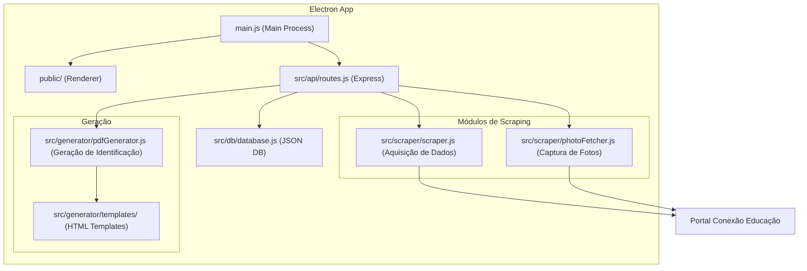
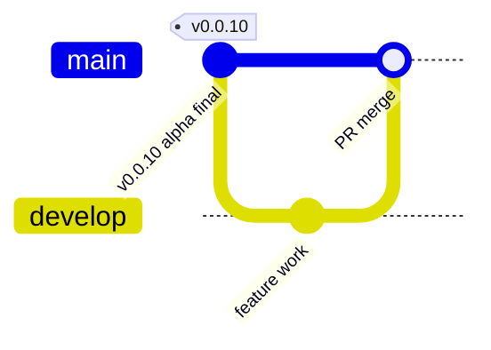
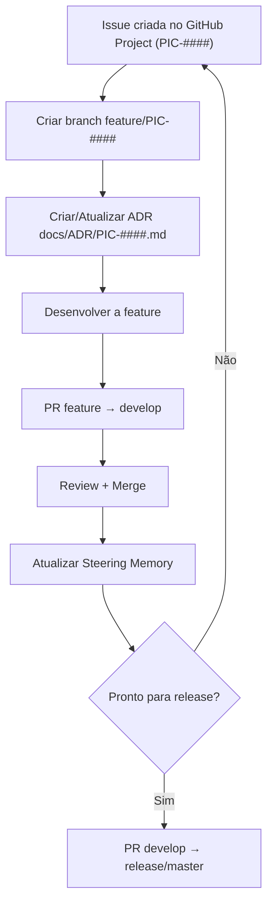

# Picasso — Steering Memory

> **Última atualização**: 2026-09-17
> **Propósito**: Documentação viva do projeto Picasso. Cada seção descreve **como** um módulo ou aspecto do sistema funciona atualmente e **por quê**, referenciando o ADR que justifica o comportamento.
>
> Este documento é a **porta de entrada** para qualquer agente de IA ou desenvolvedor que precise entender a lógica do projeto sem ler código.
> Se a informação que você procura não está aqui, trata-se de um **"lack of specification"** — crie a especificação no ADR vigente e atualize este documento.

---

## Índice

- [1. Visão Geral](#1-visão-geral)
- [2. Arquitetura de Alto Nível](#2-arquitetura-de-alto-nível)
- [3. Módulos do Sistema](#3-módulos-do-sistema)
- [4. Branching Model e Versionamento](#4-branching-model-e-versionamento)
- [5. Fluxo de Desenvolvimento](#5-fluxo-de-desenvolvimento)
- [6. Registro de Decisões Ativas](#6-registro-de-decisões-ativas)

---

## 1. Visão Geral

**Picasso** é uma aplicação desktop (Electron) para geração automatizada de carteirinhas estudantis a partir de dados raspados do portal **Conexão Educação** (SEEDUC-RJ).

| Aspecto | Detalhe | Ref |
|---------|---------|-----|
| Tipo | Desktop offline (Electron) | [ADR-003](ADR/ADR-ALPHA-BASELINE.md#adr-003) |
| Idioma | pt-BR | [ADR-005](ADR/ADR-ALPHA-BASELINE.md#adr-005) |
| Stack | Electron + Vanilla JS + Express + JSON DB | [ADR-006](ADR/ADR-ALPHA-BASELINE.md#adr-006) |
| Distribuição | Instalador `.exe` via electron-builder | [ADR-011](ADR/ADR-ALPHA-BASELINE.md#adr-011) |
| Multi-escola | Sim, parametrizável | [ADR-012](ADR/ADR-ALPHA-BASELINE.md#adr-012) |

---

## 2. Arquitetura de Alto Nível

---

## 3. Módulos do Sistema

### 3.1 Autenticação (Login)

O portal SEEDUC possui CAPTCHA, impossibilitando login automático. O diretor faz login manualmente em uma janela Electron embutida. Após autenticação, os cookies de sessão são capturados e reutilizados pelos módulos de scraping.

- **Comportamento atual (v0.0.10)**: Login é feito na Home Screen da aplicação. Sucesso exibe confirmação visual. Cookies ficam em memória durante o ciclo de vida da aplicação.
- **Evolução planejada**: Persistência criptografada de cookies via `safeStorage` do Electron (Pós-V1).
- **Ref**: [ADR-002](ADR/ADR-ALPHA-BASELINE.md#adr-002), [ADR-020](ADR/ADR-ALPHA-BASELINE.md#adr-020)

### 3.2 Módulo AdD (Aquisição de Dados)

Extrai nomes, matrículas e turmas do relatório `RelAlunosMatPTurma` do SEEDUC.

- **Comportamento atual**: Itera por **todos os semestres** disponíveis no dropdown, extrai turmas de cada semestre, e para cada turma extrai os alunos. Dados são persistidos no JSON DB.
- **Ref**: [ADR-007](ADR/ADR-ALPHA-BASELINE.md#adr-007)

### 3.3 Módulo CdF (Captura de Fotos)

Baixa as fotos dos alunos da página `Alunos.aspx` do SEEDUC.

- **Comportamento atual**: Usa workers paralelos (BrowserWindow ocultas). Cada worker busca aluno por matrícula, aguarda carregamento do componente DevExpress, e extrai a imagem via canvas ou fetch.
- **Particularidade SEEDUC**: O portal **hardcoda** `alt="sem foto"` em todas as imagens, independente de ter foto ou não. O scraper **ignora** o atributo `alt` e valida apenas pela URL (`DXCache`, `DXR.axd`, etc.).
- **Avatar padrão**: Quando o aluno realmente não tem foto (URL vazia, `#`, ou contendo `sem_foto`), um avatar padrão local é aplicado.
- **Reprocessamento**: Suporta flag "forçar reprocessamento" que re-baixa fotos independente do status atual.
- **Ref**: [ADR-008](ADR/ADR-ALPHA-BASELINE.md#adr-008)

### 3.4 Módulo GdI (Geração de Identificação / PDF)

Gera PDFs A4 com carteirinhas dos alunos.

- **Comportamento atual**: Monta HTML completo (template A4 + template de carteirinha), salva em arquivo temporário, carrega em BrowserWindow oculta via `loadFile()`, e usa `printToPDF()` para gerar o PDF. O arquivo temporário é deletado após a geração.
- **Nota técnica**: O carregamento via `loadFile()` (ao invés de `data:` URI) é obrigatório para evitar `ERR_INVALID_URL` quando as imagens base64 embutidas excedem o limite de URL do Chromium.
- **Ref**: [ADR-009](ADR/ADR-ALPHA-BASELINE.md#adr-009)

### 3.5 Armazenamento (JSON DB)

- **Comportamento atual**: Arquivo JSON simples lido inteiramente em memória ao iniciar. Salvamento síncrono a cada mutação.
- **Localização**: `%APPDATA%/picasso/data/picasso_db.json`
- **Ref**: [ADR-004](ADR/ADR-ALPHA-BASELINE.md#adr-004)

---

## 4. Branching Model e Versionamento

> [!WARNING]
> **Em refinamento** — Ver [PIC-1](ADR/PIC-1.md) para o ADR em discussão.

### Estado atual (Alpha)

### Branches existentes
- `master` — produção estável (default)
- `develop` — integração contínua

### Branching model proposto (a definir em PIC-1)
- `feature/PIC-####` — branches de trabalho por tarefa
- `hotfix/PIC-####` — correções críticas de produção
- `release` — staging/UAT (a criar)
- Regras de incremento de versão por branch — **pendente**
- Merge-back automático master → develop — **pendente**

---

## 5. Fluxo de Desenvolvimento

A partir da v0.0.10, o fluxo de desenvolvimento segue estas etapas:

### Regras de documentação
1. **Antes de codar**: Criar o ADR `docs/ADR/PIC-####.md` com contexto e decisão
2. **Após merge**: Atualizar `docs/steering/memory.md` com as mudanças
3. **Lack of specification**: Se um agente IA não encontra info no Steering Memory, deve criar a especificação no ADR vigente e atualizar este documento

---

## 6. Registro de Decisões Ativas

| Chave | Título | Status | ADR |
|-------|--------|--------|-----|
| PIC-1 | Esquema de versionamento e branching model | 🔄 Em Discussão | [PIC-1.md](ADR/PIC-1.md) |

### Histórico Alpha (Congelado)

Todas as decisões da fase Alpha (ADR-001 a ADR-020) estão documentadas no [ADR-ALPHA-BASELINE.md](ADR/ADR-ALPHA-BASELINE.md).

---

## Changelog do Steering Memory

| Data | Alteração |
|------|-----------|
| 2026-09-17 | Criação do documento. Consolidação de todos os módulos a partir do ADR Alpha Baseline (v0.0.10). |
